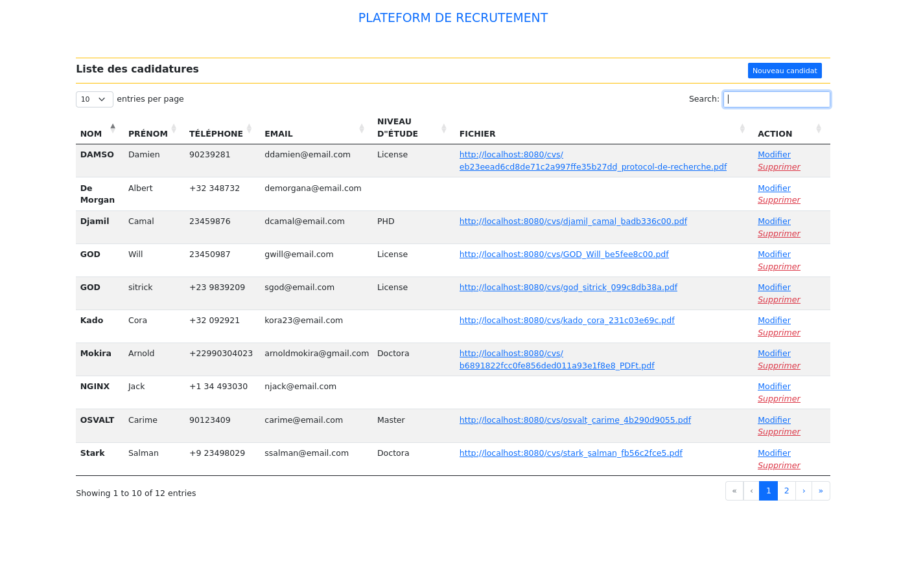

# Plateforme de recrutement


<div align="center">
    
</div>

## Base de données
Pour créer la base de données, exécuter la commande suivante :

```sh
mysql -u root -p < recrutementdb.sql
```

## Serveur web
Pour démarrer le serveur de développement, il faut exécuter la commande suivante :

```sh
make run
```
